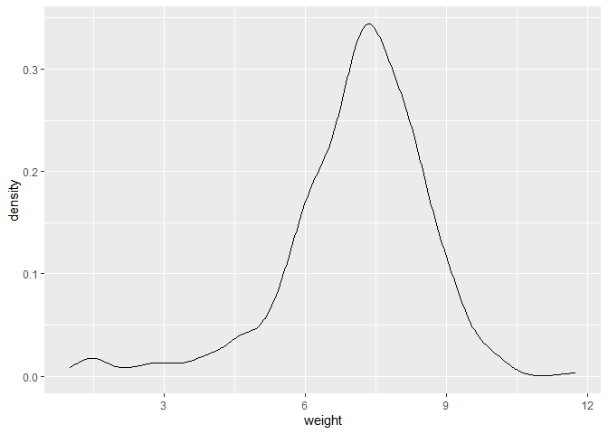
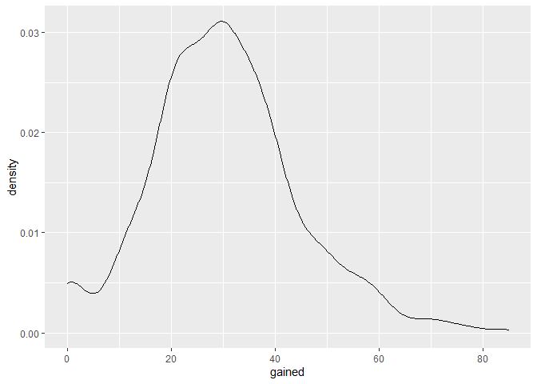
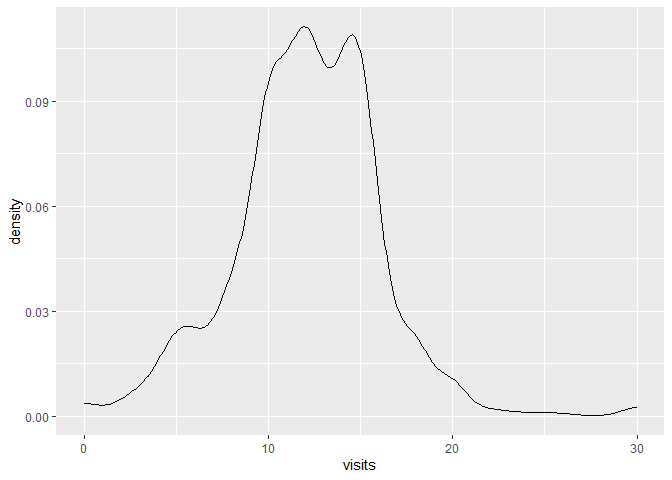
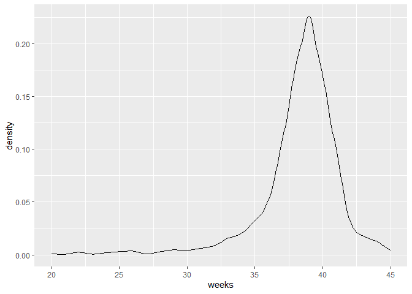
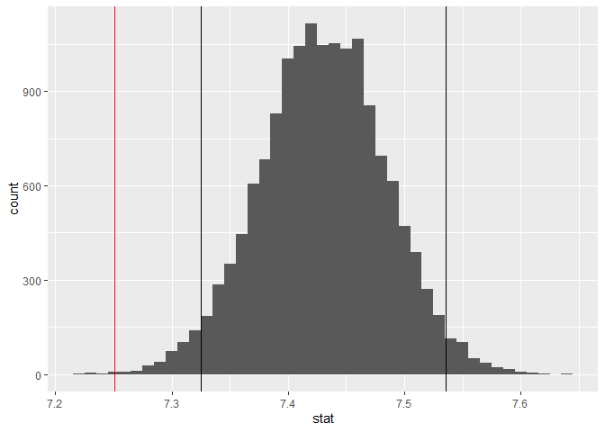
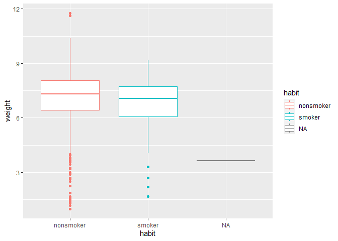
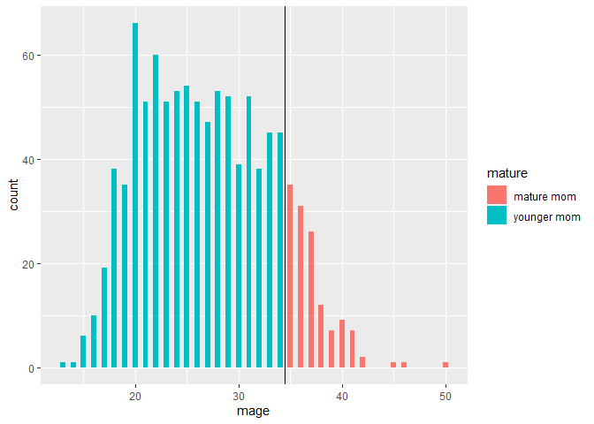

Lab 11 - Smoking during pregnancy
================
Qilin Zhang
3/30/23

### Load packages and data

``` r
library(tidyverse) 
library(tidymodels)
library(openintro)
library(psych)
library(skimr)
library(boot)
```

### Exercise 1

I see 13 variables in total. There are 6 numeric variables and 7
categorical variables.

``` r
data(ncbirths)

describe(ncbirths)
```

    ##                 vars    n  mean    sd median trimmed   mad min   max range
    ## fage               1  829 30.26  6.76  30.00   30.01  7.41  14 55.00 41.00
    ## mage               2 1000 27.00  6.21  27.00   26.81  7.41  13 50.00 37.00
    ## mature*            3 1000  1.87  0.34   2.00    1.96  0.00   1  2.00  1.00
    ## weeks              4  998 38.33  2.93  39.00   38.66  1.48  20 45.00 25.00
    ## premie*            5  998  1.15  0.36   1.00    1.07  0.00   1  2.00  1.00
    ## visits             6  991 12.10  3.95  12.00   12.18  2.97   0 30.00 30.00
    ## marital*           7  999  1.61  0.49   2.00    1.64  0.00   1  2.00  1.00
    ## gained             8  973 30.33 14.24  30.00   29.78 13.34   0 85.00 85.00
    ## weight             9 1000  7.10  1.51   7.31    7.23  1.22   1 11.75 10.75
    ## lowbirthweight*   10 1000  1.89  0.31   2.00    1.99  0.00   1  2.00  1.00
    ## gender*           11 1000  1.50  0.50   1.00    1.50  0.00   1  2.00  1.00
    ## habit*            12  999  1.13  0.33   1.00    1.03  0.00   1  2.00  1.00
    ## whitemom*         13  998  1.72  0.45   2.00    1.77  0.00   1  2.00  1.00
    ##                  skew kurtosis   se
    ## fage             0.29    -0.25 0.23
    ## mage             0.26    -0.64 0.20
    ## mature*         -2.16     2.66 0.01
    ## weeks           -2.01     7.66 0.09
    ## premie*          1.93     1.74 0.01
    ## visits           0.17     2.14 0.13
    ## marital*        -0.47    -1.78 0.02
    ## gained           0.46     0.74 0.46
    ## weight          -1.14     2.69 0.05
    ## lowbirthweight* -2.47     4.12 0.01
    ## gender*          0.01    -2.00 0.02
    ## habit*           2.25     3.06 0.01
    ## whitemom*       -0.95    -1.09 0.01

``` r
skim(ncbirths)
```

|                                                  |          |
|:-------------------------------------------------|:---------|
| Name                                             | ncbirths |
| Number of rows                                   | 1000     |
| Number of columns                                | 13       |
| \_\_\_\_\_\_\_\_\_\_\_\_\_\_\_\_\_\_\_\_\_\_\_   |          |
| Column type frequency:                           |          |
| factor                                           | 7        |
| numeric                                          | 6        |
| \_\_\_\_\_\_\_\_\_\_\_\_\_\_\_\_\_\_\_\_\_\_\_\_ |          |
| Group variables                                  | None     |

Data summary

**Variable type: factor**

| skim_variable  | n_missing | complete_rate | ordered | n_unique | top_counts         |
|:---------------|----------:|--------------:|:--------|---------:|:-------------------|
| mature         |         0 |             1 | FALSE   |        2 | you: 867, mat: 133 |
| premie         |         2 |             1 | FALSE   |        2 | ful: 846, pre: 152 |
| marital        |         1 |             1 | FALSE   |        2 | mar: 613, not: 386 |
| lowbirthweight |         0 |             1 | FALSE   |        2 | not: 889, low: 111 |
| gender         |         0 |             1 | FALSE   |        2 | fem: 503, mal: 497 |
| habit          |         1 |             1 | FALSE   |        2 | non: 873, smo: 126 |
| whitemom       |         2 |             1 | FALSE   |        2 | whi: 714, not: 284 |

**Variable type: numeric**

| skim_variable | n_missing | complete_rate |  mean |    sd |  p0 |   p25 |   p50 |   p75 |  p100 | hist  |
|:--------------|----------:|--------------:|------:|------:|----:|------:|------:|------:|------:|:------|
| fage          |       171 |          0.83 | 30.26 |  6.76 |  14 | 25.00 | 30.00 | 35.00 | 55.00 | ▃▇▇▂▁ |
| mage          |         0 |          1.00 | 27.00 |  6.21 |  13 | 22.00 | 27.00 | 32.00 | 50.00 | ▃▇▇▂▁ |
| weeks         |         2 |          1.00 | 38.33 |  2.93 |  20 | 37.00 | 39.00 | 40.00 | 45.00 | ▁▁▁▇▂ |
| visits        |         9 |          0.99 | 12.10 |  3.95 |   0 | 10.00 | 12.00 | 15.00 | 30.00 | ▂▇▇▁▁ |
| gained        |        27 |          0.97 | 30.33 | 14.24 |   0 | 20.00 | 30.00 | 38.00 | 85.00 | ▂▇▅▁▁ |
| weight        |         0 |          1.00 |  7.10 |  1.51 |   1 |  6.38 |  7.31 |  8.06 | 11.75 | ▁▁▇▇▁ |

``` r
# visualization

ncbirths %>%
  ggplot(aes(x=weight))+
  geom_density()
```

<!-- -->

``` r
ncbirths %>%
  ggplot(aes(x=gained))+
  geom_density()
```

    ## Warning: Removed 27 rows containing non-finite values (`stat_density()`).

<!-- -->

``` r
ncbirths %>%
  ggplot(aes(x=visits))+
  geom_density()
```

    ## Warning: Removed 9 rows containing non-finite values (`stat_density()`).

<!-- -->

``` r
ncbirths %>%
  ggplot(aes(x=weeks))+
  geom_density()
```

    ## Warning: Removed 2 rows containing non-finite values (`stat_density()`).

<!-- -->

### Exercise 2&3

It seems like there is only a few means lower than 7.250462 in the
bootstrapping sample. After accounting for the proportion of the means
lower than 7.25, the p value with 15000 rep of bootstraping is 0.0005.
As a result, we can conclude that the mean of child’s weight is
significantly lower than those in 1995.

``` r
ncbirths_white <- ncbirths %>%
  filter(whitemom == "white")

mean(ncbirths_white$weight)
```

    ## [1] 7.250462

``` r
#bootstrap
boot_bir_white <- ncbirths_white %>%
  # specify the variable of interest
  specify(response = weight) %>%
  # generate 15000 bootstrap samples
  generate(reps = 15000, type = "bootstrap") %>%
  # calculate the mean of each bootstrap sample 
  calculate(stat = "mean")

boot_bir_white %>%
  summarize(lower = quantile(stat, 0.025),
            mean = mean(stat),
            upper = quantile(stat, 0.975))
```

    ## # A tibble: 1 × 3
    ##   lower  mean upper
    ##   <dbl> <dbl> <dbl>
    ## 1  7.14  7.25  7.35

``` r
boot_bir_white$stat <- boot_bir_white$stat - (mean(ncbirths_white$weight) - 7.43)
mean(boot_bir_white$stat)
```

    ## [1] 7.430019

``` r
boot_bir_white %>%
  summarize(lower = quantile(stat, 0.025),
            mean = mean(stat),
            upper = quantile(stat, 0.975))
```

    ## # A tibble: 1 × 3
    ##   lower  mean upper
    ##   <dbl> <dbl> <dbl>
    ## 1  7.32  7.43  7.53

``` r
boot_bir_white %>%
  filter(stat <= 7.250462) %>%
  nrow()/nrow(boot_bir_white)# p value = 0.0005
```

    ## [1] 6e-04

``` r
#visual
boot_bir_white %>%
  ggplot(aes(x=stat)) + 
  geom_histogram(binwidth = 0.01)+
  geom_vline(xintercept = 7.324958)+
  geom_vline(xintercept = 7.53526)+
  geom_vline(xintercept = 7.250462, color = "red")
```

<!-- -->

``` r
  labs(title = "distribution for bootstrap means")
```

    ## $title
    ## [1] "distribution for bootstrap means"
    ## 
    ## attr(,"class")
    ## [1] "labels"

\###exercise 4

one sample t-test suggests that the mean of child’s weight is
significantly lower than those in 1995.

``` r
t.test(x= ncbirths_white$weight,mu = 7.43)
```

    ## 
    ##  One Sample t-test
    ## 
    ## data:  ncbirths_white$weight
    ## t = -3.3472, df = 713, p-value = 0.0008593
    ## alternative hypothesis: true mean is not equal to 7.43
    ## 95 percent confidence interval:
    ##  7.145153 7.355771
    ## sample estimates:
    ## mean of x 
    ##  7.250462

\###exercise 5 -6

From the plots, it seems like the baby weight of non-smokers are higher
than smokers.

``` r
ncbirths %>%
  ggplot(aes(x=habit, y = weight, color = habit)) + 
  geom_boxplot()
```

<!-- -->

``` r
ncbirths_habitgiven <- ncbirths %>%
  filter(habit != "NA")
```

\###exercise 7+8

Null hypothesis: There is no difference between baby weight with smoking
and non-smoking parents among the population. Alternative hypothesis:
There is difference between baby weight with smoking and non-smoking
parents among the population.

``` r
ncbirths_habitgiven %>%
  group_by(habit) %>%
  summarise(mean_weight = mean(weight),
            median_weight = median(weight))
```

    ## # A tibble: 2 × 3
    ##   habit     mean_weight median_weight
    ##   <fct>           <dbl>         <dbl>
    ## 1 nonsmoker        7.14          7.31
    ## 2 smoker           6.83          7.06

\###exercise 9

There is difference between baby weight with smoking and non-smoking
parents among the population. In particular, the baby weight with
smoking parents are significantly lower than those of the non-smoking
parents. The confident interval represents that we have 95% of confident
that the results t value will land between 0.45-4.16.

``` r
Smokers <- ncbirths_habitgiven %>%
  filter(habit=="smoker") %>%
  select(weight)
Smokers$id <- c(1:nrow(Smokers))

nonsmokers <- ncbirths_habitgiven %>%
  filter(habit=="nonsmoker") %>%
  select(weight)
nonsmokers$id <- c(1:nrow(nonsmokers))
smoking_boot <- merge(nonsmokers,Smokers,
                      by = "id",
                      all = T) %>%
  select(!id)

tstat <- function(data, i) {
  x <- data[i,1]
  y <- data[i,2]
  t.test(x, y)$statistic
}

set.seed(1234)
boot_result <- boot(smoking_boot, tstat, R=15000)
mean(boot_result$t)
```

    ## [1] 2.340838

``` r
#confident interval
quantile(boot_result$t,0.025)
```

    ##      2.5% 
    ## 0.4502762

``` r
quantile(boot_result$t,0.975)
```

    ##    97.5% 
    ## 4.163082

``` r
# transfer t to p
t_to_p <- function(t, df) {
  p <- 2 * pt(abs(t), df = df, lower.tail = FALSE)
  return(p)
}
t_to_p(mean(boot_result$t) ,999-2)
```

    ## [1] 0.01943685

``` r
t.test(smoking_boot$weight.x,smoking_boot$weight.y)
```

    ## 
    ##  Welch Two Sample t-test
    ## 
    ## data:  smoking_boot$weight.x and smoking_boot$weight.y
    ## t = 2.359, df = 171.32, p-value = 0.01945
    ## alternative hypothesis: true difference in means is not equal to 0
    ## 95 percent confidence interval:
    ##  0.05151165 0.57957328
    ## sample estimates:
    ## mean of x mean of y 
    ##  7.144273  6.828730

\###exercise 11

It looks like cutoff is at 34 to 35.

``` r
cutoff <- ncbirths_habitgiven%>%
  filter(mature=="younger mom")%>%
  select(mage)%>%
  max()%>%
  as.numeric()
cutoff
```

    ## [1] 34

``` r
ggplot(ncbirths_habitgiven, aes(x = mage, fill = mature))+
  geom_histogram(binwidth = 0.5)+
  geom_vline(xintercept = cutoff+0.5)
```

<!-- -->

\###exercise 12+13

Null hypothesis: the proportion of low birth weight babies is not
different among mature or non-mature mothers Alternative hypothesis: the
proportion of low birth weight babies is higher for mature mothers

It seems like there is no significant difference on the proportion of
low birthweight babies between mature and non-mature mothers. Therefore,
the original hypothesis in the question does not stand.

``` r
mature_lowweight <- ncbirths_habitgiven %>%
  select(c(mature,lowbirthweight)) %>%
  table()
#direct way
chisq.test(mature_lowweight,simulate.p.value = T,B = 10000)
```

    ## 
    ##  Pearson's Chi-squared test with simulated p-value (based on 10000
    ##  replicates)
    ## 
    ## data:  mature_lowweight
    ## X-squared = 0.54151, df = NA, p-value = 0.5604

``` r
chi_sq_stat <- function(data, indices) {
  tbl <- data[indices,]
  chisq <- chisq.test(tbl)$statistic
  return(chisq)
}

boot_results <- boot(data = mature_lowweight, statistic = chi_sq_stat, R = 10000)
# confident intervals
boot.ci(boot_results, type = "basic",conf = 0.95)
```

    ## BOOTSTRAP CONFIDENCE INTERVAL CALCULATIONS
    ## Based on 10000 bootstrap replicates
    ## 
    ## CALL : 
    ## boot.ci(boot.out = boot_results, conf = 0.95, type = "basic")
    ## 
    ## Intervals : 
    ## Level      Basic         
    ## 95%   ( 0.3441,  0.6883 )  
    ## Calculations and Intervals on Original Scale
